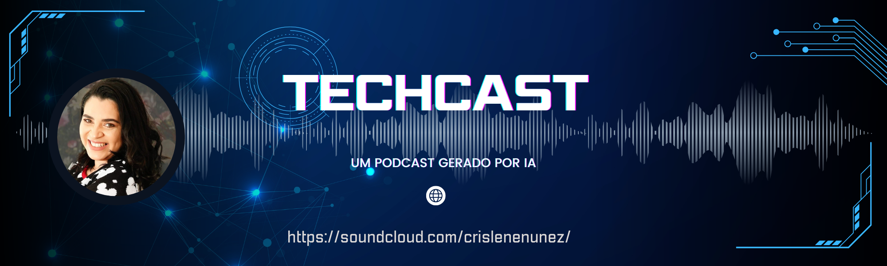
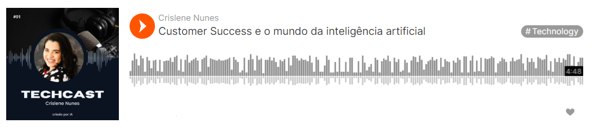
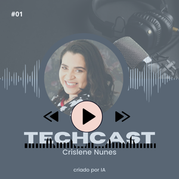

# Podcast com IA

## Ferramentas utilizadas

## Conteúdo

- [Descrição](#descrição)
- [Por dentro do podcast TechCast](#por-dentro-do-podcast-techcast)
- [Tecnologias utilizadas](#tecnologias-utilizadas)
- [Ouça o TechCast](#ouça-o-techcast)
- [Autor](#autor)

## Descrição
Desenvolvido no BootCamp Inteligência Artificial para Devs, uma parceria entre Santander e a plataforma DIO em maio/junho de 2024, este projeto de podcast visa explorar diversas ferramentas de IA em todas as etapas de sua criação. Utilizando processamento de linguagem natural para geração de roteiros, assistentes virtuais para gravação e edição de áudio, e algoritmos de análise de dados para distribuição e marketing, o projeto oferece uma experiência prática e abrangente. Desde o planejamento até a análise de feedback, cada fase do podcast é assistida por soluções avançadas de IA, proporcionando aos participantes do BootCamp uma aplicação real e inovadora de seus conhecimentos adquiridos.

## Por dentro do podcast TechCast
O TechCast é um podcast dedicado a explorar as fronteiras da tecnologia e da inovação. No primeiro episódio, mergulhamos no fascinante mundo do Customer Success no contexto da Inteligência Artificial. Abordamos como o Customer Success evoluiu de um simples suporte ao cliente para uma abordagem estratégica que visa garantir que os clientes obtenham o máximo valor dos produtos ou serviços. Discutimos o papel fundamental da IA nesse cenário, destacando ferramentas como chatbots, sistemas de recomendação e análise preditiva, que revolucionam a forma como as empresas interagem com seus clientes.

## Tecnologias utilizadas
[ChatGPT](https://chatgpt.com/): Utilizado para a geração de roteiros.

[Canva Pro](https://www.canva.com/): Utilizado para a criação das capas dos episódios.

[ElevenLabs](https://elevantlab.com/): Utilizado para a geração de áudios.

[Capcut](https://www.capcut.com/pt-br/): Utilizado para a edição e tratamento dos áudios.

## Ouça o TechCast

  
Clique na imagem para ser direcionado para o PodCast.

## Autor

Desenvolvido por Crislene Nunes, uma aspirante no universo da tecnologia, apaixonada por inteligência artificial.

#### conect-se comigo:

-[Linkedin](https://linkedin.com/in/crislenenunes) 

-[GitHub](https://github.com/crislenenunes/) 

-[Instagram](https://instagram.com/crislenenunez) 

-[SoulCloud](https://soundcloud.com/crislenenunez/) 

##

  <a href="https://www.dio.me/sign-up?ref=CX2N5FGXUZ"><b>Clique aqui e inscreva-se na plataforma DIO e tenha acesso a BootCamps gratuitos dos temas mais atuais!</b></a>

